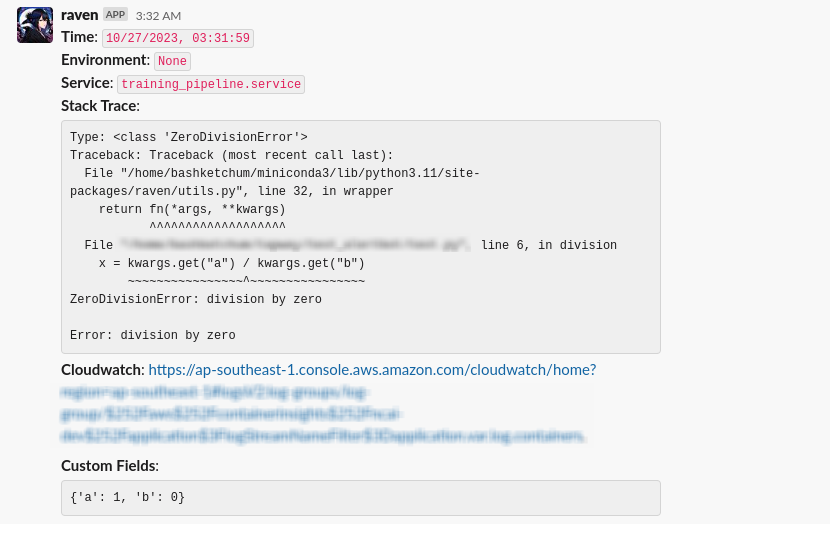

# Raven

[](https://github.com/tapway/raven/actions/workflows/python-package.yml) <br>

<p align="center">
    <i>A rather opinionated tool to raise alerts and report data.</i>
<p>

<p align="center">
    
</p>
<p align="center">
    <i>She is watching your application with <b>great concern</b></i>
<p>

## Installation

```shell
pip install git+http://git@github.com/tapway/raven.git
```

## What it produces
<p align="center">
    
</p>
<p align="center">
    This is what you get from the default settings, you can also choose to extend this with the barebone API.
</p>

## Using with configuration file

### With AWS Secrets Manager

1. Create a secret in AWS secret manager with BOT_TOKEN variable in the secret
2. Make sure the machine/pod/container has appropriate permissions to get secrets from AWS Secrets Manager
3. You have your config yaml file in correct directory

Example yaml file,

```yaml
channels:
  alert_channel: CXXXXXXXXXX # can be obtained from slack channel settings
cloudwatch: <IF YOU HAVE A CLOUDWATH PREFIX URL | OPTIONAL>
service: <YOUR SERVICE NAME | OPTIONAL>
params: <IF YOU WISH TO HAVE INPUT PARAMS | OPTIONAL>
aws_sm_secret: <YOUR SECRET NAME>
aws_region: <YOUR AWS REGION>
```

Note: For cloudwatch link to work, your app should be running in a kubernetes cluster, otherwise, it will skip sending the cloudwatch link.

#### Automatic alert

Sends alert to the first channel in the yaml file,

```python
from raven.utils import alert

@alert(
    config_path="raven_config.yaml"
)
def example_func():
    x = 1/0 # this raises error, do not catch the error
```

Sends alert to specified channel in the yaml file,

```python
from raven.utils import alert

@alert(
    config_path="raven_config.yaml",
    channel="alert_channel"
)
def example_func():
    x = 1/0 # this raises error, do not catch the error
```

#### In try-catch

```python
from raven.utils import send_alert

def example_func():
    try:
        x = 1/0
    except Exception:
        # for raven to catch this error
        send_alert_with_config(
            config_path="raven_config.yaml"
        )
```

### With token

Example yaml file,

```yaml
channels:
  alert_channel: CXXXXXXXXXX # can be obtained from slack channel settings
cloudwatch: <IF YOU HAVE A CLOUDWATH PREFIX URL | OPTIONAL>
service: <YOUR SERVICE NAME | OPTIONAL>
params: <IF YOU WISH TO HAVE INPUT PARAMS | OPTIONAL>
```

Note: For cloudwatch link to work, your app should be running in a kubernetes cluster, otherwise, it will skip sending the cloudwatch link.

#### Automatic alert

Sends alert to the first channel in the yaml file,

```python
from raven.utils import alert

@alert(
    config_path="raven_config.yaml",
    token=<BOT_TOKEN>
)
def example_func():
    x = 1/0 # this raises error, do not catch the error
```

Sends alert to specified channel in the yaml file,

```python
from raven.utils import alert

@alert(
    config_path="raven_config.yaml",
    token=<BOT_TOKEN>,
    channel="alert_channel"
)
def example_func():
    x = 1/0 # this raises error, do not catch the error
```

#### In try-catch

```python
from raven.utils import send_alert

def example_func():
    try:
        x = 1/0
    except Exception:
        # for raven to catch this error
        send_alert_with_config(
            config_path="raven_config.yaml",
            token=<BOT_TOKEN>
        )
```

### Using barebone API

#### Automatic alert

```python
from raven.utils import alert

@alert(
    token=<YOUR SLACK TOKEN>,
    channel_id=<YOUR SLACK CHANNEL ID>,
)
def example_func():
    x = 1/0 # this raises error, do not catch the error
```

#### In try-catch

```python
from raven.utils import send_alert

def example_func():
    try:
        x = 1/0
    except Exception:
        # for raven to catch this error
        send_alert(
            token=<YOUR SLACK TOKEN>,
            channel_id=<YOUR SLACK CHANNEL ID>,
        )
```

## Optional parameters

`environment` can be passed as an optional param in all options
`callbacks` can be passed as an optional param in all options
